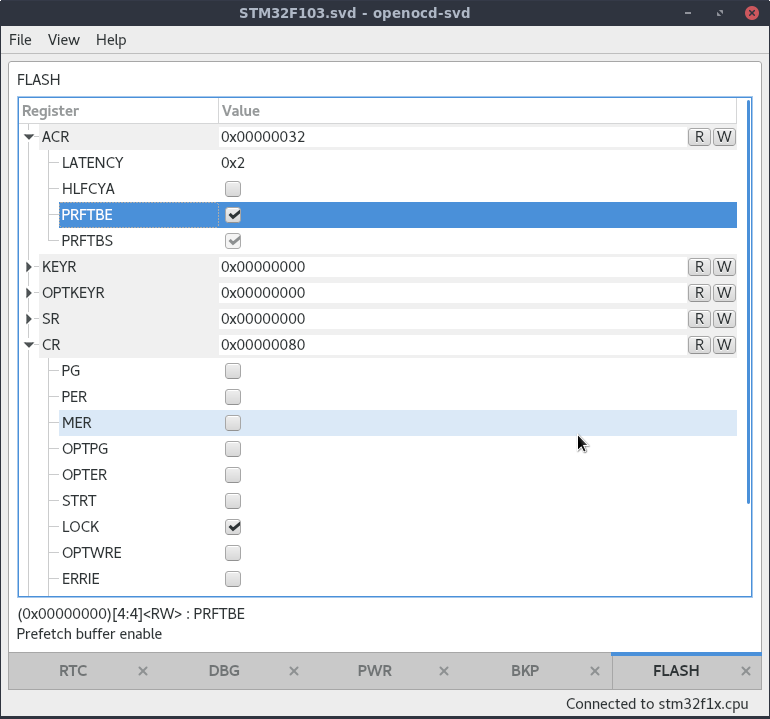

## What is openocd-svd?

openocd-svd is a Python-based GUI utility to access peripheral registers of ARM MCUs via combination of [OpenOCD](http://openocd.org/) and [CMSIS-SVD](http://cmsis.arm.com/).

## Dependencies

- [Python 3+](https://www.python.org/downloads/)
- [openocd](http://openocd.org/)
- [PyQt5](https://pypi.org/project/PyQt5/)
- [cmsis-svd](https://github.com/posborne/cmsis-svd) Python parser

## How to use

- Find and download SVD file with peripheral register structure of your MCU (can be found in Google, vendor site or [cmsis-svd](https://github.com/posborne/cmsis-svd) repo)
- Connect MCU with OpenOCD any way you like (GDB, raw scripts, etc)
- Start openocd-svd and open SVD file (or pass path to SVD as first argument at start)
- Press Connect to access OpenOCD via telnet interface (localhost 4444)
- use View menu to access peripheral registers you want

## TODO

- show registers inside complex SVD types like clusters, cluster and register arrays in true heirachical way
